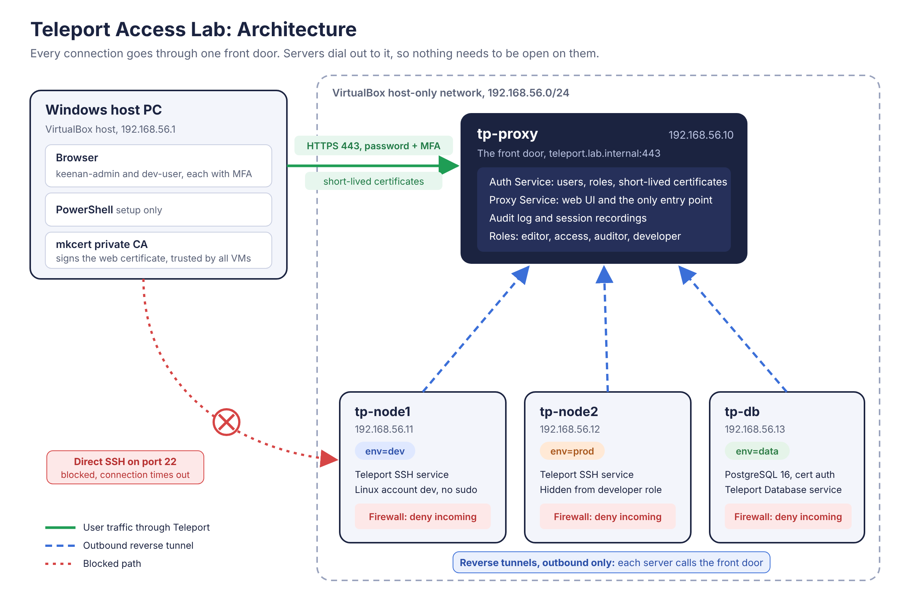

# Teleport Access Lab

A home lab that puts **Teleport** in front of Linux servers and a PostgreSQL database, so every login is tied to a real person, protected by MFA, granted through short-lived certificates, limited by role, and recorded.

Built on **Teleport Community Edition 18.11.0**, **Ubuntu Server 24.04**, **PostgreSQL 16**, and **VirtualBox**.



---

## The Business Problem

Most companies still reach their servers and databases the old way. Engineers get SSH keys or shared passwords, and those keys:

- **Never expire.** A key made three years ago still works today.
- **Get copied around.** Laptops, scripts, chat messages, old backups.
- **Outlive the job.** People change roles or leave, and their access quietly stays behind.
- **Leave no trail.** When an auditor asks "who ran that command on the production server last Tuesday," nobody can answer.

Every one of those is a common way attackers get in, and a common audit finding.

This lab shows a different model. There's **one front door** for every server and database. Every person signs in with a password plus MFA, gets a certificate that **expires on its own**, can only see what their role allows, and has **every session recorded and every database query logged.** The servers themselves have **no open ports at all**. They call out to the front door, so there's nothing for an attacker to knock on.

---

## What This Lab Proves

Every claim below links to a screenshot from the actual build.

| # | Claim | Proof |
|---|---|---|
| 1 | Every login requires a password and an authenticator code | [W1-01](captures/week1/W1-01.png) |
| 2 | Servers join through outbound reverse tunnels and are labeled by environment | [W2-01](captures/week2/W2-01.png), [W2-02](captures/week2/W2-02.png) |
| 3 | Admins reach servers through Teleport in the browser, with no SSH keys handed out | [W2-03](captures/week2/W2-03.png) |
| 4 | Each server's firewall blocks **all** incoming connections, and Teleport still works | [W2-04](captures/week2/W2-04.png) |
| 5 | Direct SSH to a server times out | [W2-05](captures/week2/W2-05.png) |
| 6 | A developer role is written as code, scoped to `env=dev` servers and one Linux account | [W3-01](captures/week3/W3-01.png) |
| 7 | The developer can't even **see** the production server or the database | [W3-02](captures/week3/W3-02.png) |
| 8 | Inside the dev server, the developer is denied admin-only files | [W3-03](captures/week3/W3-03.png) |
| 9 | The developer's session was recorded, and the admin can play it back | [W3-04](captures/week3/W3-04.png) |
| 10 | The audit log shows who started and ended each session, and where | [W3-05](captures/week3/W3-05.png) |
| 11 | The database is queried in the browser through Teleport, as a read-only database user | [W3-06](captures/week3/W3-06.png) |
| 12 | The audit log records **the exact SQL query**, who ran it, and as which database user | [W3-07](captures/week3/W3-07.png) |

---

## How It Works

**The front door, tp-proxy.** Runs Teleport's Auth Service and Proxy Service. It's the only machine anyone connects to. It issues short-lived certificates, enforces roles, and keeps the audit log and session recordings. Its web page uses a certificate from a private certificate authority made with mkcert, so the browser shows a real padlock.

**The servers, tp-node1 and tp-node2.** Each runs Teleport's SSH service and is tagged with a label: `env=dev` or `env=prod`. Each one opens a **reverse tunnel** to the front door, so it reaches out instead of waiting for connections. That's why a firewall set to **deny all incoming traffic** doesn't break anything.

**The database, tp-db.** PostgreSQL only accepts connections that present a certificate signed by Teleport, and only from the machine itself. Teleport's Database Service sits next to it and connects out to the front door the same way the servers do.

**The users.**

| User | Roles | Can reach |
|---|---|---|
| `keenan-admin` | editor, access, auditor | Everything, plus the database as the read-only user `labreader` |
| `keenan-backup` | editor, access, auditor | Break-glass admin, so a lost phone can't lock out the cluster |
| `dev-user` | developer | Only `env=dev` servers, only as the Linux account `dev`, which has no admin rights |

**The developer role, as code:**

```yaml
kind: role
version: v7
metadata:
  name: developer
spec:
  allow:
    logins: ['dev']
    node_labels:
      'env': 'dev'
  deny: {}
```

Anything not listed under `allow` is blocked by default.

---

## Skills Demonstrated

| Area | What I did |
|---|---|
| **Privileged access** | Identity-aware proxy, short-lived certificates instead of static keys, MFA on every login, break-glass admin account |
| **Least privilege and RBAC** | Wrote a role as code, scoped access with resource labels, used a non-admin Linux account and a read-only database user |
| **Audit and accountability** | Session recording and playback, audit log review, database query logging |
| **Zero trust networking** | Reverse tunnels, default-deny firewalls with `ufw`, no inbound ports on protected servers |
| **PKI** | Private certificate authority, OS trust stores, a TLS certificate for the web front door, certificate-only database authentication |
| **Linux administration** | `systemd` services, `netplan` static addressing, `apt`, users and file permissions, `journalctl` troubleshooting |
| **Database** | PostgreSQL install, TLS configuration, `pg_hba.conf` authentication rules, users and grants |
| **Troubleshooting** | Nine real build problems diagnosed and fixed, all documented in the [build log](BUILD-LOG.md) |

---

## Lab-Only Shortcuts

This is a home lab, so a few things were done the simple way. Here's what a real company would do instead.

| Shortcut in this lab | What a real company would do instead |
|---|---|
| mkcert private certificate authority on the host PC | A managed internal certificate authority, or a public certificate on a real domain |
| Hosts file entries instead of DNS | Real DNS records for the cluster name |
| Auth and Proxy on one VM | Separate, redundant Auth and Proxy servers |
| Join tokens copied by hand | Automatic joining, like cloud identity join methods, so no token is ever copied |
| The `dev` Linux account made by hand | Teleport creates accounts on demand at login and removes them after |
| Database user `labreader` made by hand | Teleport creates database users on demand, with only the permissions the role allows |
| Database certificate renewed by hand, about every 3 months | Automatic renewal before expiry |
| Local Teleport users | Users come from the company's single sign-on, like Okta or Entra ID. That's a paid Teleport feature |
| tp-proxy still accepts direct SSH, for setup | The Teleport servers are also locked down and reached through a break-glass process |
| Local Linux passwords still exist on each VM | No standing passwords at all |

---

## Lessons Learned

The full story is in the [build log](BUILD-LOG.md). The three that taught the most:

1. **Clones aren't unique until you make them unique.** Every copied VM shared the same machine ID, which made them all request the same network address. Giving each VM a new machine ID, new SSH keys, and its own fixed address fixed it.
2. **A recording only exists once the session ends cleanly.** When the front door froze mid-session, the recording never got handed over. Ending sessions with `exit` is what triggers the upload.
3. **The front door needs headroom.** Running Auth, Proxy, the web interface, and recording uploads on 2 GB of memory caused repeated freezes. 4 GB fixed it.

---

## Rebuild It Yourself

The runbooks are written for someone who has never used Linux. Every step says which window to use, repeats every value it needs, and flags where to take screenshots.

| Runbook | What it builds |
|---|---|
| [Week 1: The front door](runbooks/week1-front-door.md) | Four Ubuntu VMs, a private certificate authority, Teleport, and an admin login with MFA |
| [Week 2: Servers behind the door](runbooks/week2-servers-behind-the-door.md) | Joining two servers, labeling them, and locking them down with firewalls |
| [Week 3: Roles, recording, database](runbooks/week3-roles-recording-database.md) | The developer role, the denied attempt, session playback, and PostgreSQL through Teleport |

**What you need:** a Windows PC with about 10 GB of free memory, VirtualBox, and the Ubuntu Server 24.04 ISO. Everything else is free.

> ⚠️ **Note:** Teleport Community Edition is free for personal and home lab use. Companies above a certain size need a commercial license. See Teleport's license terms.

---

## Repo Layout

```
teleport-access-lab/
├── README.md
├── BUILD-LOG.md
├── diagrams/
│   ├── architecture.svg
│   └── architecture.png
├── captures/
│   ├── week1/   W1-01 to W1-02
│   ├── week2/   W2-01 to W2-05
│   └── week3/   W3-01 to W3-07
└── runbooks/
    ├── week1-front-door.md
    ├── week2-servers-behind-the-door.md
    ├── week3-roles-recording-database.md
    └── week4-write-up-and-publish.md
```
